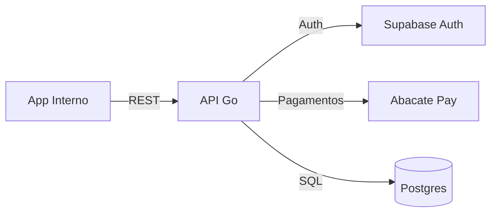
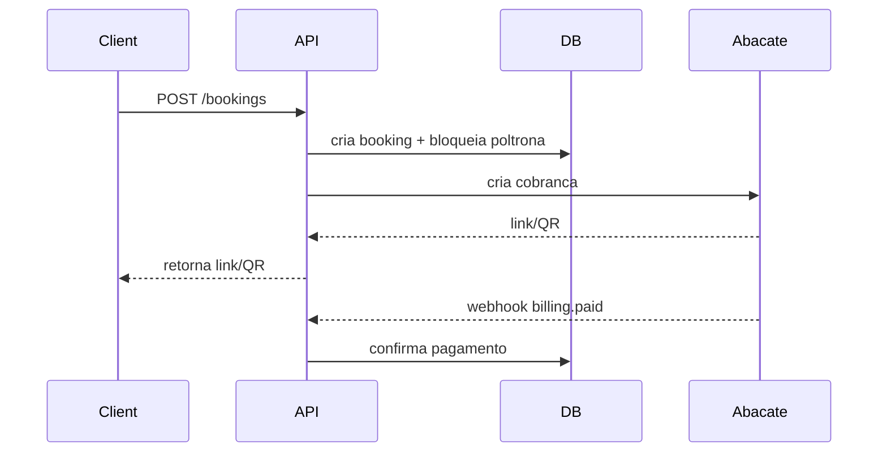

**Plano API Detalhado (Visao Completa)**

**Objetivo da API**
A API e o centro do sistema. Ela aplica as regras de negocio, integra autenticacao e pagamentos, e serve o `app` e integracoes externas futuras.

**Escopo do MVP**
- CRUD de viagens, rotas, onibus, motoristas e poltronas.
- Reservas com bloqueio de poltrona.
- Pagamentos (sinal, total e manual).
- Webhooks da Abacate Pay.
- Relatorio/manifesto de passageiros.

**Nao Escopo (MVP)**
- Integraчуo direta com WhatsApp (apenas API pronta).
- Motor de precos dinamicos complexo.
- Emissao fiscal.

**Diagrama de Alto Nivel**


**Estrutura de Pastas**
```
apps/api
+- cmd/api/main.go
+- internal
ж  +- auth
ж  ж  +- middleware.go
ж  ж  +- jwks_cache.go
ж  +- shared
ж  ж  +- http/router.go
ж  ж  +- http/response.go
ж  ж  +- http/errors.go
ж  ж  +- db/db.go
ж  ж  +- db/tx.go
ж  ж  +- config/config.go
ж  ж  +- logging/logger.go
ж  ж  +- validation/validators.go
ж  +- trips
ж  ж  +- handler.go
ж  ж  +- service.go
ж  ж  +- repository.go
ж  ж  +- model.go
ж  +- routes
ж  ж  +- handler.go
ж  ж  +- service.go
ж  ж  +- repository.go
ж  ж  +- model.go
ж  +- buses
ж  ж  +- handler.go
ж  ж  +- service.go
ж  ж  +- repository.go
ж  ж  +- model.go
ж  +- bookings
ж  ж  +- handler.go
ж  ж  +- service.go
ж  ж  +- repository.go
ж  ж  +- model.go
ж  ж  +- seat_hold.go
ж  +- payments
ж  ж  +- handler.go
ж  ж  +- service.go
ж  ж  +- repository.go
ж  ж  +- model.go
ж  ж  +- abacatepay_client.go
ж  +- reports
ж  ж  +- handler.go
ж  ж  +- service.go
ж  +- users
ж     +- handler.go
ж     +- service.go
+- pkg/abacatepay
ж  +- client.go
ж  +- models.go
ж  +- webhook.go
+- migrations
ж  +- 0001_init.sql
ж  +- 0002_core_tables.sql
+- go.mod
+- README.md
```

**Responsabilidade por Arquivo (Resumo)**

| Caminho | Responsabilidade |
| --- | --- |
| `apps/api/cmd/api/main.go` | Inicializa config, logger, router, DB e server HTTP. |
| `internal/auth/middleware.go` | Valida JWT do Supabase e injeta usuario na request. |
| `internal/auth/jwks_cache.go` | Busca e cacheia JWKS do Supabase. |
| `internal/shared/http/router.go` | Registra rotas e middlewares comuns. |
| `internal/shared/http/response.go` | Serializacao de resposta padrao. |
| `internal/shared/http/errors.go` | Mapear erros internos para HTTP. |
| `internal/shared/db/db.go` | Pool de conexoes e healthcheck. |
| `internal/shared/db/tx.go` | Helpers de transacao e rollback. |
| `internal/shared/config/config.go` | Carrega variaveis de ambiente e valida. |
| `internal/shared/logging/logger.go` | Logger estruturado com niveis. |
| `internal/shared/validation/validators.go` | Validacoes de payload. |
| `internal/trips/*` | CRUD de viagens, validacoes e regras. |
| `internal/routes/*` | CRUD de rotas e paradas. |
| `internal/buses/*` | CRUD de onibus, mapa de poltronas e tipos. |
| `internal/bookings/*` | Reservas, bloqueios e expiracao. |
| `internal/payments/*` | Cobrancas Abacate Pay e pagamentos manuais. |
| `internal/reports/*` | Relatorios e manifesto. |
| `internal/users/*` | Consulta de perfil e roles. |
| `pkg/abacatepay/*` | Cliente isolado para Abacate Pay. |

**Contratos da API**
- Base URL: `https://api.schumacher.tu.br`
- Auth: `Authorization: Bearer <supabase_jwt>`
- Erros: JSON com `code`, `message`, `details`.

**Formato de Erro (Padrao)**
```json
{
  "code": "VALIDATION_ERROR",
  "message": "Dados invalidos",
  "details": {"field": "seat_id"}
}
```

**Principais Endpoints (MVP)**
- `POST /trips`
- `GET /trips`
- `PATCH /trips/:id`
- `POST /routes`
- `POST /buses`
- `POST /bookings`
- `GET /bookings/:id`
- `POST /payments`
- `GET /payments/:id/status`
- `POST /payments/manual`
- `POST /webhooks/abacatepay`
- `GET /reports/passengers`

**Exemplos de Payload**

`POST /trips`
```json
{
  "route_id": "uuid",
  "bus_id": "uuid",
  "driver_id": "uuid",
  "departure_at": "2026-02-10T18:00:00Z",
  "arrival_at": "2026-02-12T12:00:00Z",
  "fare_id": "uuid"
}
```

`POST /bookings`
```json
{
  "trip_id": "uuid",
  "passenger": {"name": "Maria", "document": "000.000.000-00"},
  "seat_id": "uuid",
  "payment_intent": "DEPOSIT"
}
```

`POST /payments`
```json
{
  "booking_id": "uuid",
  "amount": 150.00,
  "method": "PIX",
  "description": "Sinal passagem"
}
```

`POST /payments/manual`
```json
{
  "booking_id": "uuid",
  "amount": 200.00,
  "method": "CASH",
  "notes": "Pago no embarque"
}
```

`POST /webhooks/abacatepay`
```json
{
  "event": "billing.paid",
  "data": {"billingId": "abc123"}
}
```

**Fluxo Tecnico de Reserva + Pagamento**


**Regras de Negocio na API**
- Sem overbooking.
- Poltrona bloqueada por viagem.
- Sinal e restante configuraveis por tarifa.
- Cancelamento configuravel.
- Pagamento manual permitido.

**Estados Principais**
- `booking.status`: `PENDING`, `CONFIRMED`, `CANCELLED`, `EXPIRED`.
- `payment.status`: `PENDING`, `PAID`, `FAILED`, `REFUNDED`.

**Variaveis de Ambiente (Minimo)**
- `APP_ENV`
- `PORT`
- `DATABASE_URL`
- `SUPABASE_JWKS_URL`
- `SUPABASE_ISSUER`
- `SUPABASE_AUDIENCE`
- `ABACATEPAY_API_KEY`
- `ABACATEPAY_WEBHOOK_SECRET`

**Testes**
- Unit tests para `service.go`.
- Integration tests para `handler.go` com DB de teste.
- Testes de idempotencia para webhook.

