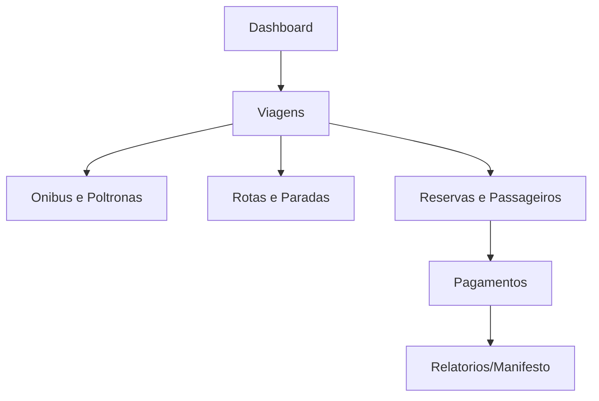
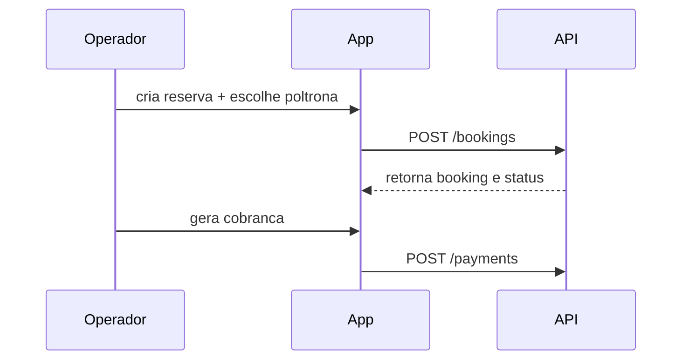

**Plano App (Sistema Interno) Detalhado (Visao Completa)**

**Objetivo do App**
Sistema interno usado pela equipe para operacao de viagens, vendas e financeiro.

**Estrutura de Pastas**
```
apps/app
+- public
+- src
ж  +- app
ж  ж  +- App.tsx
ж  ж  +- routes.tsx
ж  ж  +- providers.tsx
ж  +- pages
ж  ж  +- Dashboard
ж  ж  +- Trips
ж  ж  +- Routes
ж  ж  +- Buses
ж  ж  +- Drivers
ж  ж  +- Bookings
ж  ж  +- Payments
ж  ж  +- Reports
ж  +- components
ж  ж  +- Table
ж  ж  +- SeatMap
ж  ж  +- BookingForm
ж  ж  +- PaymentStatus
ж  ж  +- Filters
ж  +- services
ж  ж  +- api.ts
ж  ж  +- trips.ts
ж  ж  +- bookings.ts
ж  ж  +- payments.ts
ж  ж  +- reports.ts
ж  +- hooks
ж  ж  +- useAuth.ts
ж  +- state
ж  ж  +- store.ts
ж  +- styles
ж  ж  +- theme.css
ж  +- types
ж     +- index.ts
+- index.html
+- package.json
+- vite.config.ts
+- tailwind.config.ts
```

**Responsabilidade por Arquivo/Pasta**

| Caminho | Responsabilidade |
| --- | --- |
| `src/app/App.tsx` | Shell principal, layout e guardas de rota. |
| `src/app/routes.tsx` | Definicao das rotas e permissoes. |
| `src/app/providers.tsx` | Providers globais (tema, query, auth). |
| `src/pages/Dashboard` | Indicadores e alertas operacionais. |
| `src/pages/Trips` | CRUD de viagens e datas. |
| `src/pages/Routes` | CRUD de rotas e paradas. |
| `src/pages/Buses` | Cadastro de onibus e mapa de poltronas. |
| `src/pages/Drivers` | Cadastro e vinculo de motoristas. |
| `src/pages/Bookings` | Reservas, passageiros e status. |
| `src/pages/Payments` | Pagamentos, sinal e manual. |
| `src/pages/Reports` | Exportacao de manifesto. |
| `src/components/SeatMap` | Grid de poltronas e status. |
| `src/components/BookingForm` | Formulario de reserva e passageiro. |
| `src/services/api.ts` | Cliente HTTP base com auth. |
| `src/services/trips.ts` | Chamadas de viagens. |
| `src/services/bookings.ts` | Chamadas de reservas. |
| `src/services/payments.ts` | Chamadas de pagamentos. |
| `src/hooks/useAuth.ts` | Login, logout e roles. |
| `src/state/store.ts` | Estado global (filtros, cache). |

**Fluxo de Operacao no App**


**Fluxo de Reserva no App**


**Matriz de Acesso (MVP)**
| Funcao | admin | operador | financeiro |
| --- | --- | --- | --- |
| Criar viagem | sim | sim | nao |
| Editar poltronas | sim | sim | nao |
| Registrar pagamento | sim | nao | sim |
| Gerar manifesto | sim | sim | sim |

**UI States Importantes**
- `Loading` para chamadas da API.
- `Empty` quando nao ha viagens.
- `Error` com mensagem de validaчуo.
- `Success` para confirmacoes.

**Exportacao de Manifesto**
- PDF e Excel.
- Campos: nome, documento, poltrona, status pagamento.

