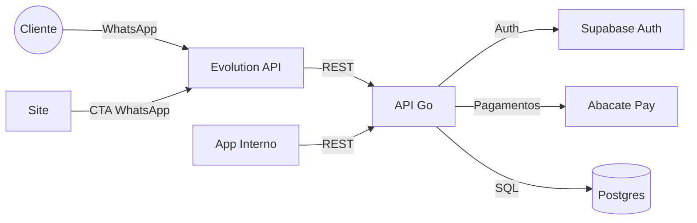
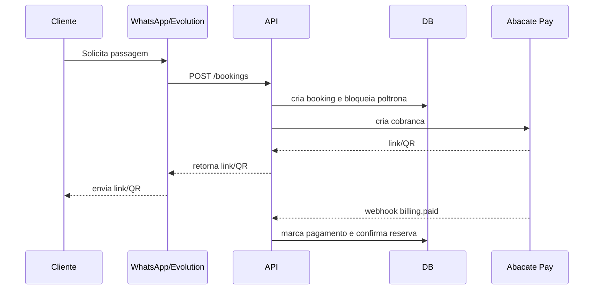
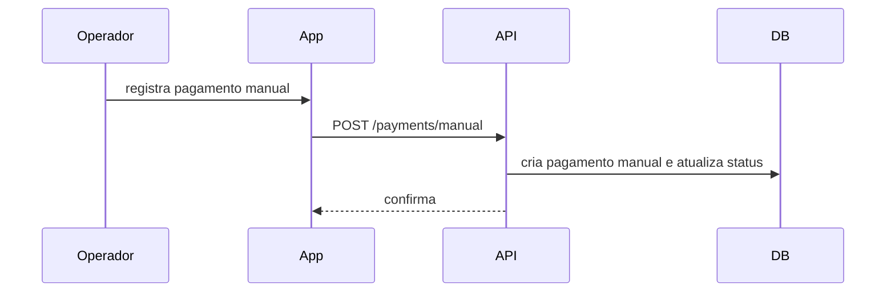
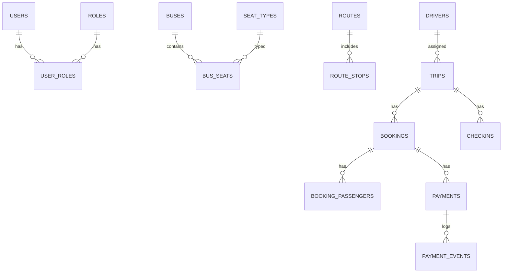

**Plano Geral Detalhado (Visao Completa do Sistema)**

**Objetivo**
Este documento descreve o sistema de ponta a ponta, para que qualquer pessoa consiga entender o que sera construído, por que, e como ele se organiza tecnicamente.

**Contexto do Negocio**
A Schumacher Turismo opera viagens rodoviarias entre estados (ex.: SC -> MA e MA -> SC). O controle atual depende de planilhas e sistemas isolados. O objetivo e centralizar a operacao em um sistema unico que controle viagens, passageiros, poltronas, motoristas e pagamentos.

**Problemas que o sistema resolve**
- Falta de visibilidade unica sobre viagens e passageiros.
- Controle manual de poltronas e pagamento parcial.
- Falta de auditoria em pagamentos manuais.
- Dificuldade para gerar manifesto de passageiros confiavel.
- Dependencia de planilhas e processos dispersos.

**Visao do Produto**
O sistema tera tres aplicacoes dentro de um monorepo:
1. `web`: site institucional (marketing e contato).
2. `app`: sistema interno para operacao e financeiro.
3. `api`: backend central com regras de negocio e integracoes.

**Perfis de Usuario (MVP)**
- `admin`: acesso total e configuracoes.
- `operador`: cria viagens, gerencia poltronas, passageiros e motoristas.
- `financeiro`: controla pagamentos, acertos e reembolsos.

**Conceitos Principais (Glossario)**
- **Viagem**: deslocamento de uma origem para um destino em uma data. Ida e volta sao duas viagens distintas.
- **Rota**: conjunto de paradas e cidades que compoem uma viagem.
- **Onibus**: veiculo com mapa de poltronas.
- **Poltrona**: assento numerado que pode ter tipo (leito, semi-leito, etc.).
- **Reserva**: bloqueio de poltrona para um passageiro antes da confirmacao final.
- **Pagamento**: registro de valores pagos (sinal, total, manual).
- **Manifesto**: lista de passageiros por viagem para conferencia do motorista.

**Escopo do MVP**
- Cadastro de onibus e mapa de poltronas.
- Cadastro de motoristas.
- Cadastro de rotas e paradas.
- Criacao de viagens com data e veiculo.
- Reservas com bloqueio de poltrona.
- Pagamento parcial (sinal) e total.
- Pagamento manual (dinheiro/cartao externo).
- Webhook de confirmacao de pagamento (Abacate Pay).
- Relatorio/manifesto exportavel (PDF/Excel).

**Fora do Escopo do MVP**
- Integracao direta com WhatsApp (apenas API pronta).
- Motor de precos dinamicos complexo.
- Emissao fiscal.

**Regras de Negocio (Detalhadas)**
- Sem overbooking: uma poltrona so pode estar ocupada por um passageiro em cada viagem.
- Poltrona bloqueada por viagem durante o processo de reserva.
- Pagamento pode ser parcial (sinal) ou total.
- Sinal e restante configuraveis por tarifa/viagem.
- Cancelamento e reembolso configuraveis.
- Pagamento manual sempre permitido e auditado.
- Tipos de poltrona opcionais (ativar/desativar).
- “Ida e volta” e representada por duas viagens vinculadas.

**Configuracoes Necessarias**
- Percentual ou valor fixo de sinal por viagem.
- Prazo e regras de pagamento do restante.
- Politica de cancelamento (prazo e multa).
- Tipos de poltrona (opcional).

**Integracoes**
- **Supabase Auth**: login e roles dos usuarios.
- **Abacate Pay**: cobranca, Pix e webhooks.
- **Evolution API**: integracao futura com WhatsApp.

**Arquitetura Macro**
- O `app` e o `web` consomem a `api` via REST.
- A `api` valida autenticacao no Supabase e grava dados no Postgres.
- A `api` cria cobrancas no Abacate Pay e recebe webhooks de confirmacao.

**Estrutura de Pastas (Monorepo)**
```
.
+- apps
¦  +- web
¦  +- app
¦  +- api
+- packages
¦  +- shared
¦  +- ui
¦  +- config
+- infra
¦  +- nginx
¦  +- systemd
¦  +- deploy
+- plans
+- turbo.json
```

**Diagrama de Contexto**


**Fluxo Principal: Reserva e Pagamento**


**Fluxo Alternativo: Pagamento Manual**


**Modelo de Dados Macro**


**Seguranca e Auditoria**
- Todas as rotas privadas exigem JWT do Supabase.
- Pagamentos manuais sao registrados com usuario, data e observacao.
- Webhooks devem ser idempotentes.

**Deploy (VPS)**
- `schumacher.tu.br` -> `apps/web`
- `app.schumacher.tu.br` -> `apps/app`
- `api.schumacher.tu.br` -> `apps/api`
- Reverse proxy com Nginx ou Caddy.

**Roadmap Macro**
1. Monorepo + pipeline.
2. Base da API Go + Auth.
3. CRUD de viagens, rotas, onibus e poltronas.
4. Reservas + pagamentos.
5. App interno MVP.
6. Relatorios e manifesto.
7. Integracao WhatsApp.
8. Migracao de dados legados.

**Riscos e Mitigacoes**
- Regras operacionais complexas: validar com time desde o inicio.
- Migracao de dados: definir mapeamento minimo antes da importacao.
- Pagamento manual: exige auditoria e permissao limitada.

**Pendencias Conhecidas**
- Politica detalhada de cancelamento/reembolso.
- Campos minimos para importacao de dados (Excel/.NET).
- Template final do manifesto.
