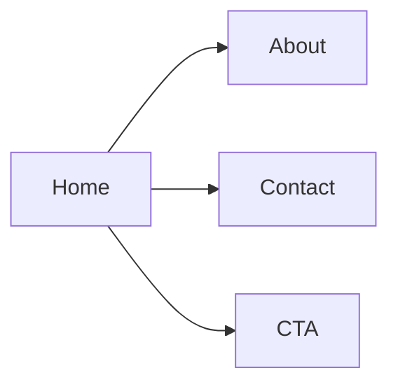

**Plano Web (Site Publico) Detalhado (Visao Completa)**

**Objetivo do Site**
Site institucional para apresentar a empresa e direcionar vendas para WhatsApp.

**Estrutura de Pastas**
```
apps/web
+- public
+- src
¦  +- App.tsx
¦  +- pages
¦  ¦  +- Home
¦  ¦  +- About
¦  ¦  +- Contact
¦  +- sections
¦  ¦  +- Hero
¦  ¦  +- Services
¦  ¦  +- Testimonials
¦  ¦  +- CTA
¦  +- components
¦  ¦  +- Navbar
¦  ¦  +- Footer
¦  ¦  +- WhatsAppButton
¦  +- assets
¦  +- styles
¦     +- theme.css
+- index.html
+- package.json
+- vite.config.ts
+- tailwind.config.ts
```

**Mapa do Site**


**Responsabilidade por Arquivo/Pasta**

| Caminho | Responsabilidade |
| --- | --- |
| `src/App.tsx` | Rotas e layout base. |
| `src/pages/Home` | Pagina principal. |
| `src/pages/About` | Historia e credibilidade. |
| `src/pages/Contact` | Contato e localizacao. |
| `src/sections/Hero` | Mensagem principal e CTA. |
| `src/sections/Services` | Descricao de servicos. |
| `src/sections/Testimonials` | Provas sociais. |
| `src/sections/CTA` | Chamada para WhatsApp. |
| `src/components/WhatsAppButton` | Botao de contato rapido. |

**SEO Basico**
- Metatags de titulo e descricao.
- Open Graph e Twitter cards.

**Escopo**
- Sem integracao direta com pagamentos ou Supabase.

